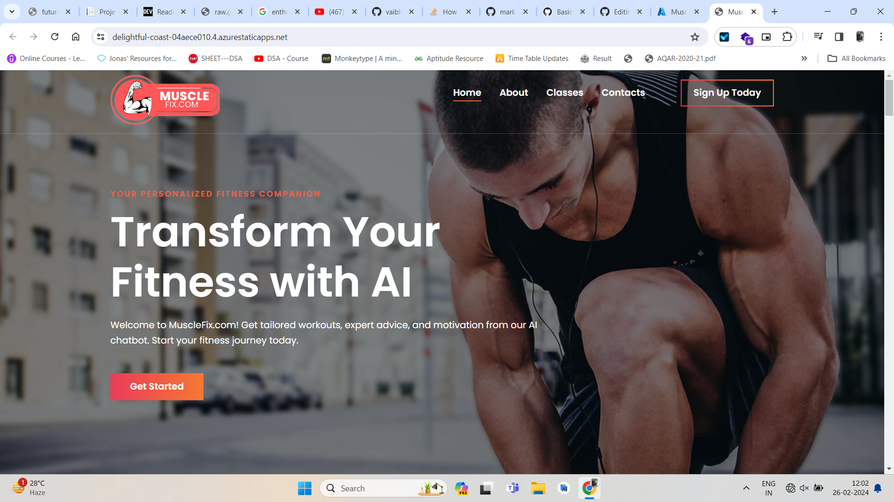

# AI-Powered-Musclefix-Fitness-Gym-Website 
This is Project i have developed to help fitness enthusiast and also Developed to Implement all the knowledge i have gained throughout this internship Process !

**Technology Used !.**
* → HTML5
* → CSS 3
* → JavaScript
* → Node.js (For Writing Function App Service)

**Azure Services Used !.**
* → Azure Static Web App **(Core)** - This Service is Used to Host Website on Server !
* → Azure Function **(Core)** - This Service i have used to Cater Http Post Request From Contact Form ! in Contact Session of Website !
* → Azure AI Bot Service **(AI)** - This Service i had used to generate QNA Bot service in website ! ( you can access this by clicking get started button on home page hero section )
* → Azure AI Language **(AI)** - This service is used to provide Knowledge Base for AI Chat Bot !

**Live Website Link**
https://delightful-coast-04aece010.4.azurestaticapps.net/ 

**Youtube Video Link**
https://youtu.be/FasxybOc9pk 

**Note :-** I have Explained All the Implementation of Azure Services in Youtube Video .
 
 
 
**MuscleFix Website Home Page** 
 

 
 
**Post Request Send by Form to Azure Function Service** 
 

  
**In Response to Post Request Function App is Sending Response Thankyou Page to Client !** 
 
   
**ChatBot Services Integrated in Website** 
 
   
**Function App Service Azure Console** 
 
   
**Static Web App Service** 
 

  

💌 Thankyou Future Ready Talent Team & Microsoft for providing me Amazing Opportunity to Learn Azure , AI & Github !  .
